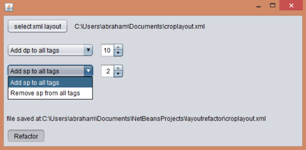

java swing ui interface that can refactor android layout xml files. 
ex. for all xml tags add or remove 10 to all dp or sp or both.  

the idea is to create a ui form that the user can choose an android layout xml file, 
set up parameters and automaticly generate xml for large and x-large layouts. 
At this point it has only the basic functions that can add/remove dp/sp from all tags. 
 
build with maven using netbeans
 

